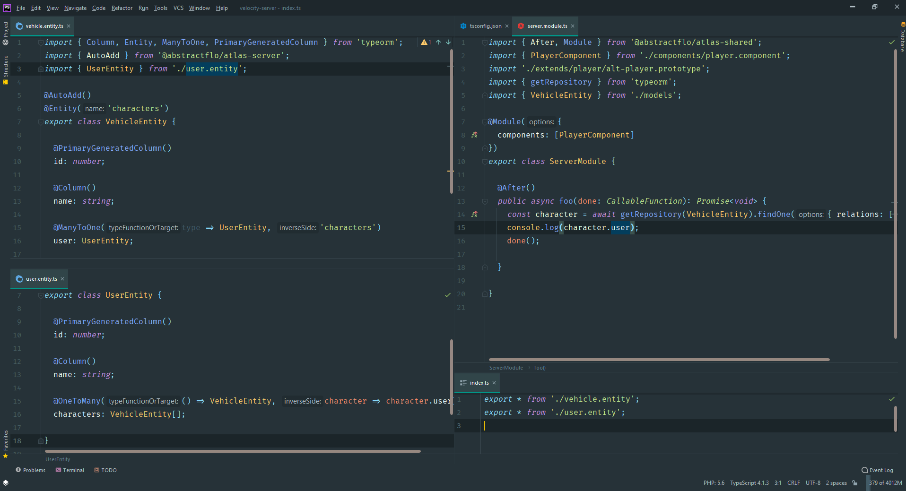

# Database

## Introduction

Our Framework has support for a wide range of database systems. This is provided by [TypeORM](https://typeorm.io/#/).  
The DatabaseService is ready to use for your gamemode. Set up your credentials inside the `.env` and start using the service.


We don't teach you the interaction and creation of databases. If you have any questions about database basics, you should take a look at the [docs](https://typeorm.io/#/).


### Before you start

We chose TypeORM because the syntax is relatively easy for everyone to understand. But we also have to point out that some things in TypeORM are not really cleanly solved. In the following we would like to point out what you have to pay attention to when you work with TypeORM.

* By nature, TypeORM creates a circular dependency when setting up a bi-directional relationship between 2 models. In ES modules circular dependencies are allowed. The compiler will warn you about this, but as long as this warning is limited to your entities, you don't need to worry.
* It can happen that you get the following error message when starting the server `XXX cannot access before initialization` This is also a known problem "admittedly also a very annoying one" but also we can't work around this at the moment, because we have no influence on when which entity is registered in the config by the decorator. If you get this error, then go into the model in concern and make your import a string import. You will lose the type safety but this is the only way to get the problem under control.

#### Example for String Imports



```typescript
/**
 * The TypeORM Way describe in docs
 */
@AutoAdd()
@Entity('firsts')
export class FirstEntity {

  @PrimaryGeneratedColumn()
  id: number;

  @Column()
  name: string;
  
  @OneToMany(() => Second, second => second.first)
  seconds: Second[]
}

/**
 * Our Way not described in TypeORM Docs
 */
@AutoAdd()
@Entity('firsts')
export class FirstEntity {

  @PrimaryGeneratedColumn()
  id: number;

  @Column()
  name: string;
  
  @OneToMany(() => Second, second => second.first)
  seconds: 'Second'[]
}
```



```typescript
/**
 * The TypeORM Way describe in docs
 */
@AutoAdd()
@Entity('seconds')
export class SecondEntity {

  @PrimaryGeneratedColumn()
  id: number;

  @Column()
  name: string;
  
  @ManyToOne(() => First, first => first.seconds)
  first: First
}

/**
 * Our Way not described in TypeORM Docs
 */
@AutoAdd()
@Entity('seconds')
export class SecondEntity {

  @PrimaryGeneratedColumn()
  id: number;

  @Column()
  name: string;
  
  @ManyToOne(() => First, first => first.seconds)
  first: 'First'
}
```



#### Another solution that works but also does not feel perfect

You can create an entry point file for your models and define the exports in the right order. I feels not really  good, but you don't lose the Typings. We don't know how complicated it is with more and more models. But try and error can solve the problem with the right order.

You can see a working example on the picture below. Keep in mind, if you change the order inside `index.ts` they would not work anymore




If you known a better TypeScript Based ORM, [let us know about it](https://discord.gg/DcpsfkVkfb). We searching for a better alternative to solve this problems.


## How to use

Using the DatabaseService is fairly simple. Create your entities, add the new [@AutoAdd](database.md#autoadd) decorator and use your entity as normal.



```typescript
@AutoAdd()
@Entity('yours')
export class YourEntity {

  @PrimaryGeneratedColumn()
  id: number;

  @Column()
  name: string;
}
```



```typescript
import { On } from '@abstractFlo/shared';
import { ExampleService } from './example.service';

export class ExampleComponent {

  constructor(
    private readonly exampleService: ExampleService
  ) {}

  /**
   * Load entries sync
   */
  @On('yourEvent')
  public loadAll(): void {
    this.exampleService
      .loadAll()
      .then((yourEntities: YourEntity[]) => {
        // Do whatever you want
      })
      .catch((err) => {
        // Do what ever you want if error
      })

  }

  /**
   * Load entries async
   */
  @On('yourEvent')
  public async loadAllAsync(): void {
    try {
      const yourEntities = await this.exampleService.loadAll();

      // do whatever you want
    } catch(err) {
      // do whatever you want if error
    }
  }

}
```



```typescript
import { injectable } from 'tsyringe';
import { YourEntity } from './your.entity';
import { getRepository, Repository } from 'typeorm';

@injectable()
export class ExampleService {

  /**
   * Get repository
   *
   * @type {Repository<YourEntity>}
   * @protected
   */
  private repo: Repository<YourEntity> = getRepository(YourEntity);


  /**
   * Return all entries
   *
   * @return {Promise<YourEntity[]>}
   */
  public getAll(): Promise<YourEntity[]> {
    return this.repo.find();
  }

}
```



### @AutoAdd

This is a new decorator to provide a simple way for adding new Entities to your database service. Only add this to your TypeORM Entity and use this entity as expected. This decorator registered the entity for you.



```typescript
@AutoAdd()
@Entity('yours')
export class YourEntity {

  @PrimaryGeneratedColumn()
  id: number;

  @Column()
  name: string;
}
```



