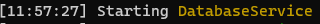
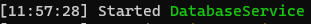

# LoggerService

## Introduction

The LoggerService is a wrapper around the alt:V log feature. It's created to fit the object-oriented requirements.  
We had to improve some parts for logging to help you out.


LoggerService is available on both sides


### Available Methods

This section describes the available methods that you can use.

#### info\(...messages: any\[\]\)

This logs the message _'Your message'_ as a default log

```typescript
@singleton()
export class YourClass {

    constructor(
        private readonly loggerService: LoggerService
    ) {}

    public yourMethod(): void {
        this.loggerService.info('Your message')
    }
}
```

#### warning\(...messages: any\[\]\)

This logs the message _'Your message'_ as a warning

```typescript
@singleton()
export class YourClass {

    constructor(
        private readonly loggerService: LoggerService
    ) {}

    public yourMethod(): void {
        this.loggerService.warning('Your message')
    }
}
```

#### error\(...messages: any\[\]\)

This logs the message _'Your message'_ as an error

```typescript
@singleton()
export class YourClass {

    constructor(
        private readonly loggerService: LoggerService
    ) {}

    public yourMethod(): void {
        this.loggerService.error('Your message')
    }
}
```

#### starting\(message: string\)

This logs a message formatted as starting

```typescript
@singleton()
export class YourClass {

    constructor(
        private readonly loggerService: LoggerService
    ) {}

    public yourMethod(): void {
        this.loggerService.starting('DatabaseService')
    }
}
```



#### started\(message: string\)

This logs a message formatted as started

```typescript
@singleton()
export class YourClass {

    constructor(
        private readonly loggerService: LoggerService
    ) {}

    public yourMethod(): void {
        this.loggerService.started('DatabaseService')
    }
}
```



